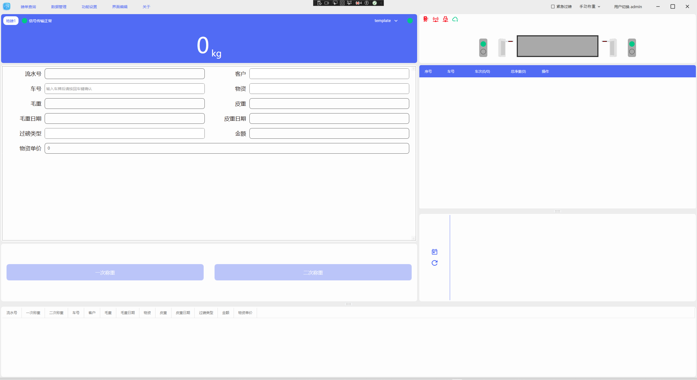
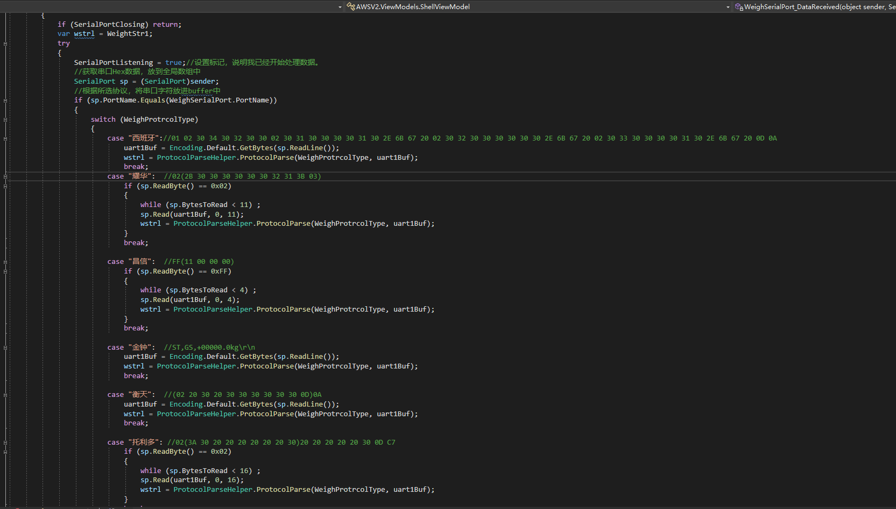
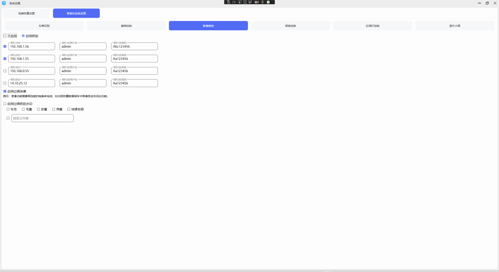
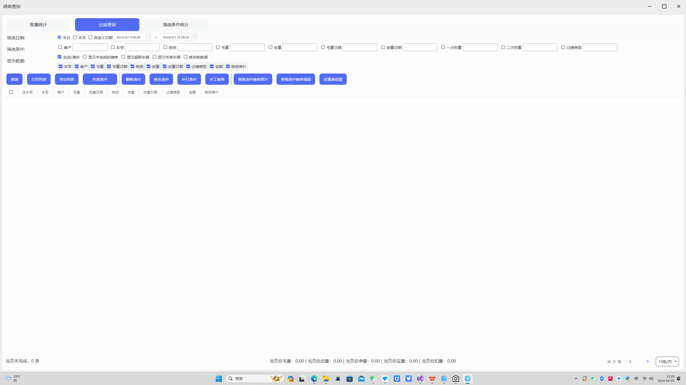
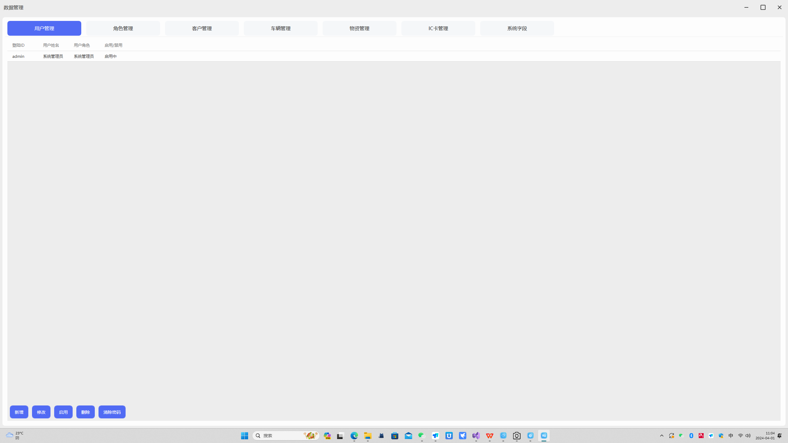

# 地磅称重系统汽车衡过磅软件

#### 介绍
软件名称	版本	开发者	发布日期	主要功能	特点
称重软件	3.0.0.1	石榴云	2024-03-20	用于汽车衡器	物联网
地磅称重软件的应用场景广泛，主要适用于需要进行大批量物品称重的场所，包括但不限于以下几个领域：
1. 物流行业：地磅称重软件在物流行业中被广泛应用。物流公司可以利用这款软件快速准确地获取货物的重量信息，这对于运费的计算、车辆的装载以及路线的规划都是至关重要的。同时，软件还可以提供实时监控和数据管理功能，方便物流公司对物品称重情况进行实时掌握。
2. 矿业：在矿业领域，地磅称重软件主要用于矿石的称重。通过这款软件，矿业公司可以监控生产情况，并根据准确的重量信息制定生产计划。此外，软件还可以实时记录和分析数据，为矿业公司的生产和管理提供有力支持。
3. 工厂、港口等场所：这些场所需要进行大批量物品的称重，地磅称重软件可以大大提高工作效率和准确性。同时，软件的数据存储和管理功能还可以方便后续查询和统计。
4. 工程建设、交通运输等领域：这些领域需要向相关部门提交称重数据报告，地磅称重软件可以自动生成称重数据报表，并可导出Excel或PDF等格式进行打印或共享。
5. 远程办公、跨区域物流等场所：在这些场所中，地磅称重软件支持远程监控和操作电子地磅，实现远程数据查询和称重控制，提高工作效率。
总之，地磅称重软件的应用场景非常广泛，几乎涵盖了所有需要进行大批量物品称重的领域。通过使用这款软件，企业可以提高工作效率、降低成本，并更好地管理和控制物品称重过程。
#### 软件架构
软件架构说明
WPF、MaterialDesign 、mqtt、http..
环境net4.8
#### 安装教程
3.2. 软件安装步骤
用户需首先下载所提供的软件压缩包文件，并进行解压操作。解压完成后，双击运行解压出	的“运行称重软件3.0.exe”可执行文件
3.3 软件将自动在桌面上创建快捷方式，以便用户快速启动。为确保软件使用的安全性，用户需牢记软件默认的登录账号“admin”及密码“123”，并妥善保管。在使用过程中，用户需遵守软件的使用规定，不得进行非法操作，确保软件的稳定运行和数据安全。
#### 软件已对接各大仪表可直接使用
  
#### 使用说明
有需要对接第三方，或者无法运行的联系我18565665465
  
  

  
  
  
  
  
