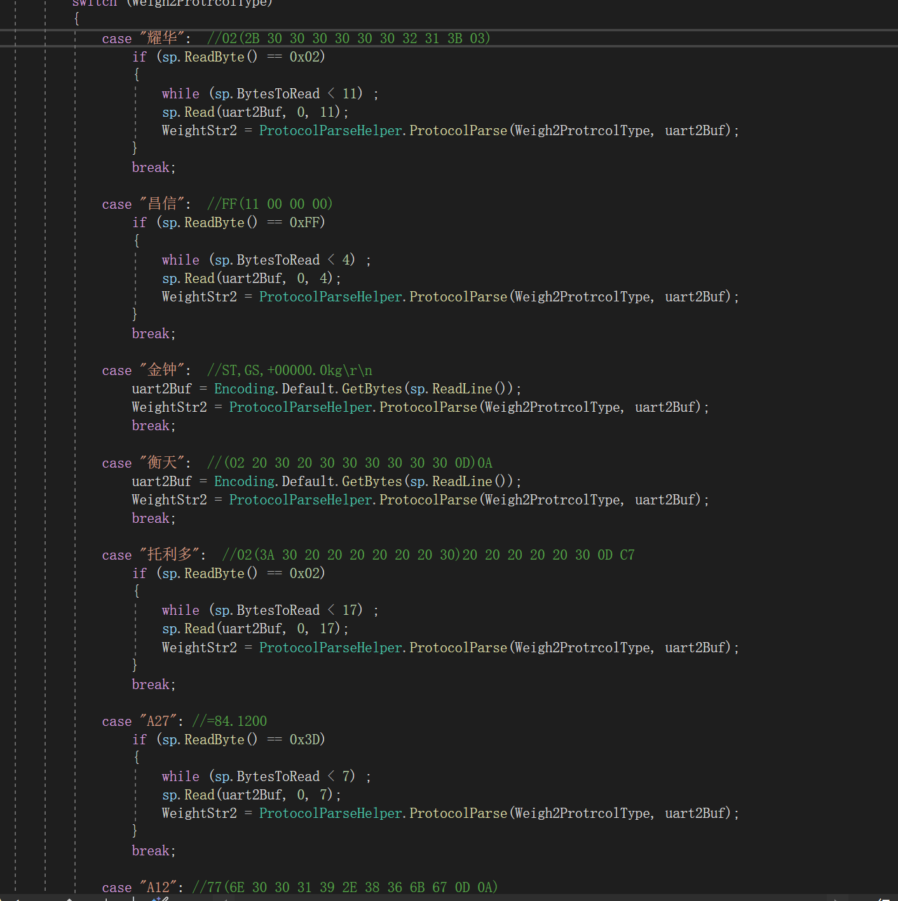
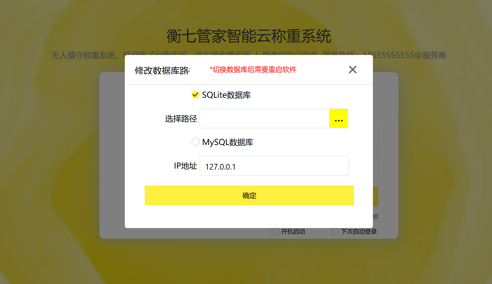
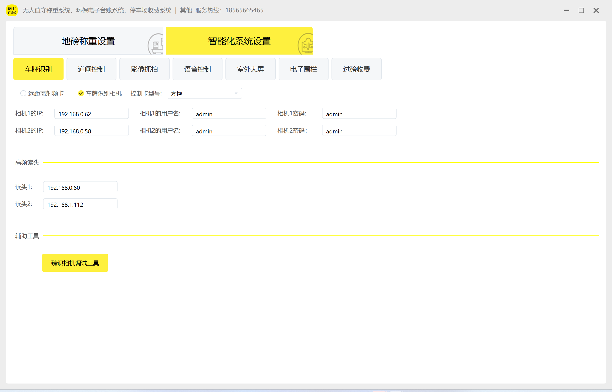
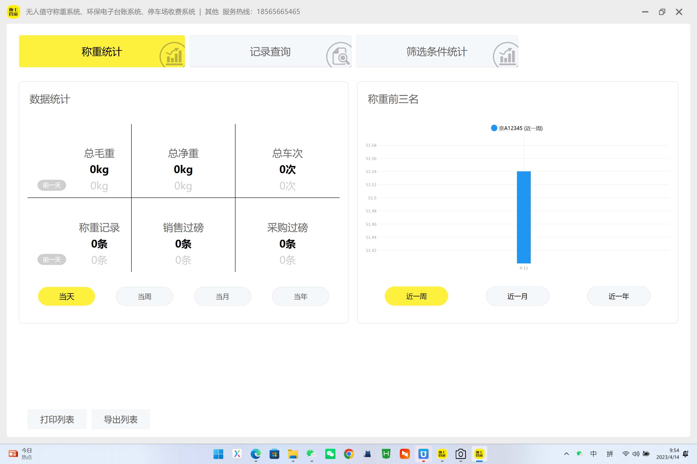
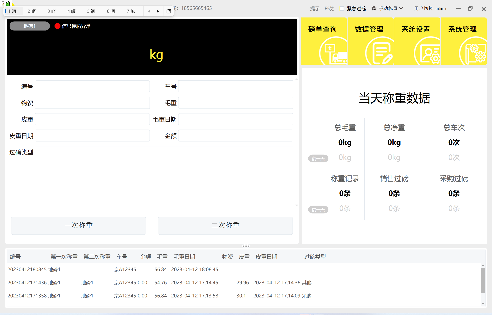
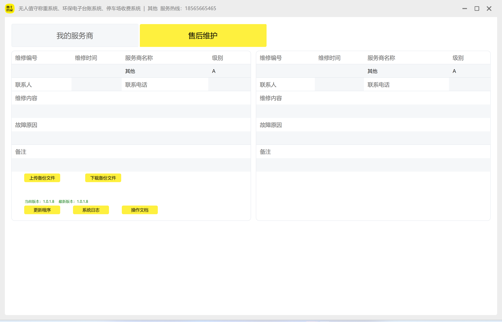

### 安装发行版 :fire:  :fire:  :fire:  :fire:  :fire: 

地磅称重软件车牌刷卡称重系统  
程序的登录密码是123
如果无法运行请联系我18565665465
目前只上传了部分代码其他的代码还在整理中，可以先运行发行版查看

### 支持了硬件对接   

  
1、对接了车牌识别相机 
2、对接了高频刷卡读头  
3、对接了二维码扫码读头  
4、对接了相机抓拍  
5、对接了LED大屏幕  
6、支持轮轴识别（外挂识别）  
7、对接了支持控制器  
8、对接了支持按钮称重  
9、对接了支持光栅防作弊  

### 目前开发完成的功能   

1、支持车牌识别上磅自动操作  
2、支持称重抓拍  
3、支持车轴计算  
4、支持大屏幕显示称重信息  
5、支持一机双衡（兼容市面上95%以上的仪表直接使用）  
6、磅单自定义  
7、磅单公式字段自动计算等功能  
8、打印支持先预览再打印支持直接打印 支持一次称重二次称重打印  
9、扣重  
10、断网扫码称重  
11、单向道闸、双向道闸  
12、支持相机直接开闸/控制器直接开闸  
13、光栅防作弊功能  
14、数据同步  
15、语音播报（支持自定义）  
16、超载报警超载控制  
17、过磅收费支持在线支付  
18、电子围栏（支持未称重完成禁止出场）  
19、数据备份 手动/自动  
### 其他功能的开发进度  

1、支持自动计算皮重毛重等  
2、excel磅单高度自定义  
3、具体看项目施工铺设图效果如下： 基本的硬件都支持ok了  
4、支持定制化或者直接找我要源代码  
5、可接入各种erp系统  
6、可在线更新  
7、支持云端备份数据/设置调试日志等内容  
8、支持云端预约，司机扫码预约  
9、支持部分源头治超平台  
10、支持软件远程管理，可设置有效期转让软件等功能    
### 运行的截图  

  
  
  
  
   
